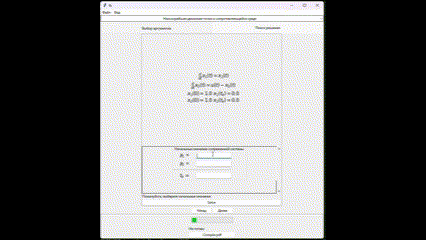

# Содержание
1. [Установка зависимостей](#установка-зависимостей)
1. [Выбор задачи](#выбор-задачи)
1. [Постановка задачи](#постановка-задачи)
1. [Решение задачи](#решение-задачи)
1. [Генерация PDF](#генерация-pdf-файла)

# Первый запуск

Для установки всех требуемых пакетов выполните в терминале:
```bash
pip install -r requirements.txt
```

# Выбор задачи
Сначала пользователь выбирает один из доступных типов задач из выпадающего списка, затем выбирает количество уравнений в системе.


# Постановка задачи и составление формул
Затем пользователь вводит вид уравнений, начальные и граничные условия и дополнительные параметры в зависимости от задачи.


# Решение задачи
На втором экране пользователь вводит дополнительные параметры для решения (например начальные значения сопряженной системы $\psi$) и производит интегрирование получившейся системы уравнений.



# Генерация PDF файла
После того как пользователь получит решение системы, с помощью __Compile pdf__ производиться генерация отчета о работе программы.

Файл содержит полученные результаты, Гамильтониан (если решение подразумевает его составление), графики процессов.

